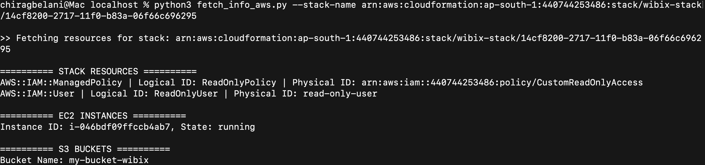

# 🛠️ AWS CloudFormation POC - ReadOnly Access + Inventory Script

This is a Proof of Concept (POC) project submitted for the internship opportunity at **Wibix Consulting**.  
It includes an AWS CloudFormation template to create a custom read-only access IAM user, and a Python script to fetch AWS resource inventory using the CloudFormation stack.

---

## 📁 Contents

- `wibix_task.yaml` — CloudFormation template file
- `fetch_info_aws.py` — Python script to fetch inventory
- `README.md` — This documentation

---

## 🚀 What It Does

1. Creates a **read-only IAM user** and **custom IAM policy** using CloudFormation.
2. Generates a **CloudFormation stack**.
3. Python script fetches and displays all **EC2 instances** and **S3 buckets** using the resources created in the stack.
4. No access keys or hardcoded credentials used. IAM roles or instance profiles are assumed.

---

## 🔧 How to Use

### Step 1: Upload CloudFormation Template to S3

Upload `wibix_task.yaml` to an S3 bucket:

cmd: aws s3 cp wibix_task.yaml s3://your-bucket-name/

### Step 2: Generate CloudFormation Launch Stack URL

On your browser go: 
[aws s3 cp wibix_task.yaml s3://your-bucket-name/](https://console.aws.amazon.com/cloudformation/home?region=us-east-1#/stacks/create/template?templateURL=https://your-bucket-name.s3.amazonaws.com/wibix_task.yaml
)

Replace your-bucket-name with your actual bucket name.

### Step 3: Run the Python Inventory Script

cmd: python3 fetch_info_aws.py --stack-name < "stack-name or stack-ARN" >

## Expected Output:

List of all CloudFormation stack resources

All EC2 instances (Instance ID + state)

All S3 buckets (bucket names)

## Delete Stack after use
cmd: aws cloudformation delete-stack --stack-name <stack-name>

